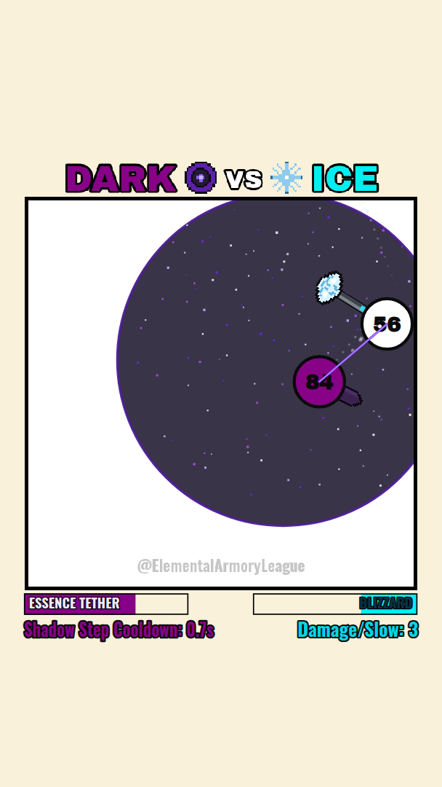

# Elemental Duel — Ombre vs Glace

Clone haute fidélité du duel d'éléments de la vidéo de référence
(*Elemental Armory League*), en **HTML + CSS + JavaScript** avec un rendu
**Canvas 2D**. Aucune dépendance, aucun build : le dépôt se publie tel quel sur
GitHub Pages.



---

## Démarrer

```bash
# n'importe quel serveur statique (les modules ES nécessitent http://, pas file://)
python3 -m http.server 8080
# puis http://localhost:8080
```

### Publier sur GitHub Pages

1. Pousse la branche.
2. *Settings → Pages → Build and deployment → Deploy from a branch*,
   branche = la tienne, dossier = `/ (root)`.
3. Le fichier `.nojekyll` (déjà présent) empêche Jekyll d'ignorer les dossiers.

Un workflow optionnel est fourni dans `.github/workflows/pages.yml`
(déclenchement manuel par défaut).

### Paramètres d'URL

| Paramètre    | Effet                                                             |
| ------------ | ----------------------------------------------------------------- |
| `?a=&b=`     | lance directement un duel (`shadow`, `ice`) sans écran de sélection |
| `?seed=1234` | rejoue **exactement** le même duel (déterminisme complet)          |
| `?lang=fr`   | HUD en français (par défaut : libellés anglais de la vidéo)        |
| `?debug=1`   | hitboxes, vitesses, charge d'ultime, seed                          |

Exemple : `index.html?a=shadow&b=ice&seed=6&debug=1`

---

## Architecture

```
index.html                 page unique : canvas + écrans DOM
styles/style.css           mise à l'échelle de la scène + écrans de sélection/fin
assets/
├── fonts/                 Archivo Black + Oswald auto-hébergées (OFL)
└── sprites/               overrides PNG facultatifs + manifeste
src/
├── main.js                bootstrap : ressources, écrans, boucle
├── core/
│   ├── loop.js            boucle à pas fixe 120 Hz + rendu rAF
│   ├── math.js            vecteurs, angles, distance segment/point
│   ├── rng.js             aléa déterministe (mulberry32) piloté par seed
│   └── fonts.js           attente des webfonts avant la 1re frame
├── data/                  ← LES DONNÉES, séparées du moteur
│   ├── elements.js        **fiches d'éléments** (gelées) : apparence, vitesse,
│   │                      arme, pouvoir, ultime, projectiles, HUD
│   ├── tuning.js          géométrie de scène mesurée sur la vidéo
│   ├── pixelmaps.js       sprites pixel-art en texte
│   └── freeze.js          deepFreeze + garde-fou d'immutabilité
├── render/
│   ├── canvas.js          repère logique 720x1280, DPR, pixel-perfect
│   ├── scene.js           décor statique (titre, arène, filigrane) mis en cache
│   ├── sprites.js         banque de sprites + overrides PNG
│   ├── pixelart.js        compilation pixel-map → canvas
│   ├── hud.js             jauges d'ultime + ligne de stat
│   ├── effects.js         particules (étincelles, neige, fantômes, ondes)
│   └── text.js            texte ajusté pour ne jamais déborder du HUD
├── game/
│   ├── match.js           machine à états du duel + dégâts + rendu global
│   ├── fighter.js         entité combattant (état runtime + dessin)
│   ├── physics.js         collisions corps/corps et arme/corps
│   ├── projectiles.js     projectiles génériques pilotés par la fiche
│   └── abilities/
│       ├── index.js       registre
│       ├── shadow.js      Pas d'ombre + Lien d'essence
│       └── ice.js         Éclats de givre + Blizzard
└── ui/
    ├── select.js          écran de sélection (lit les fiches)
    └── result.js          écran de fin
```

### Pourquoi ce découpage

- **Le moteur ne connaît aucun élément.** `fighter.js`, `physics.js` et
  `projectiles.js` lisent la fiche. Ajouter « Feu » = une entrée dans
  `elements.js` + un module dans `abilities/`, sans toucher au reste.
- **Les fiches sont gelées** (`deepFreeze`) et le duel travaille sur un état
  séparé : impossible qu'une partie modifie les stats d'un élément pour la
  suivante. `assertFrozen()` le vérifie au lancement de chaque duel.
- **Le décor est rasterisé une fois** dans un canvas hors écran, puis blitté :
  le fond ne bouge jamais (cahier des charges) et coûte un seul `drawImage`.

### Choix du langage d'animation

**JavaScript ES modules + Canvas 2D**, pas de TypeScript ni de framework :

| Option              | Verdict                                                                   |
| ------------------- | ------------------------------------------------------------------------- |
| CSS/DOM animations  | ✗ 200+ particules en DOM = saccades, pas de contrôle du pas de temps       |
| SVG + SMIL          | ✗ coût de layout à chaque frame, pas fait pour une simulation physique     |
| WebGL / PixiJS      | ✗ surdimensionné ici (2 entités + particules), et ajoute une dépendance    |
| **Canvas 2D + ESM** | ✓ 60 fps large, code lisible, zéro build, déployable en glisser-déposer    |
| TypeScript          | ✗ imposerait une étape de compilation avant chaque publication Pages       |

Le typage n'est pas perdu pour autant : les modules sont annotés en **JSDoc**,
donc VS Code fait la vérification de types (`// @ts-check` suffit à l'activer).

La boucle est à **pas fixe (120 Hz)** avec accumulateur : la simulation est
identique sur un écran 60 Hz ou 144 Hz, et les collisions arme/corps ne
« traversent » pas à haute vitesse.

---

## Fidélité à la vidéo

Toutes les constantes de mise en page proviennent d'un relevé image par image
(720 × 1280, 30 fps) ; elles sont regroupées dans `src/data/tuning.js` et
`src/data/elements.js`, chacune commentée `mesuré` ou `calé`.

| Élément mesuré                | Valeur relevée                    |
| ----------------------------- | --------------------------------- |
| Fond hors-arène               | `rgb(249,241,218)`                |
| Arène                         | carré 640 × 640 à (40, 320), bord noir 6 px |
| Boule                         | rayon 41 px, contour noir 5 px    |
| Boule Ombre / Glace           | `#870286` / `#00eff0`             |
| Portée d'arme Ombre / Glace   | 77 px / 132 px depuis le centre   |
| Rotation d'arme               | ≈ 330 °/s (0,92 tour/s), sens inversé aux rebonds |
| Vitesse de déplacement        | 400 → 500 px/s                    |
| Jauges du HUD                 | 268 × 35 px, en x = 39 et x = 412, y = 965 |
| Ligne de stat                 | ligne de base y = 1036            |
| Dôme du Lien d'essence        | rayon ≈ 270 px, `rgb(52,46,70)`   |
| Champ de Blizzard             | rayon ≈ 130 px                    |
| Progression « Shadow Step Cooldown » | 3 s → 0,7 s par paliers de 0,2 s |
| Progression « Damage/Slow »   | 1 → 13 sur un duel d'une minute   |

Le rythme est calé pour retrouver ces deux compteurs en fin de duel :
sur 12 seeds, un duel dure **45 à 56 s**, la Glace finit à **12-13 piles** et
l'Ombre atteint le plancher de **0,7 s**. Les deux éléments gagnent à peu près
autant l'un que l'autre.

---

## Ajouter un élément

1. **La fiche** dans `src/data/elements.js` (copie `SHADOW` et adapte).
   Tout y passe : couleurs, rayon, vitesse, arme, dégâts, pouvoir, ultime,
   projectiles, libellés du HUD.
2. **Les sprites** dans `src/data/pixelmaps.js` (texte) ou en PNG via
   `assets/sprites/manifest.json` — voir
   [`assets/sprites/README.md`](assets/sprites/README.md).
3. **Les pouvoirs** : un module dans `src/game/abilities/` exposant
   `init / update / drawUnder / drawOver / barValue`, puis une ligne dans
   `abilities/index.js`.
4. Ajoute son id à `ROSTER` : il apparaît dans l'écran de sélection avec sa
   fiche générée automatiquement.

Rien d'autre à modifier : HUD, sélection, physique et projectiles sont
pilotés par les données.

---

## Documentation

- [`docs/FICHES.md`](docs/FICHES.md) — fiches complètes des deux éléments
  (apparence, vitesse, pouvoirs, projectiles) et méthode de mesure.
- [`assets/sprites/README.md`](assets/sprites/README.md) — remplacer les
  sprites par les tiens.
- [`assets/fonts/LICENSE.md`](assets/fonts/LICENSE.md) — polices embarquées.

## Licence

Code sous licence MIT. Les polices sont sous SIL OFL (voir `assets/fonts/`).
La vidéo de référence appartient à ses auteurs : ce dépôt n'en redistribue
aucun extrait, les sprites sont redessinés en pixel-art.
